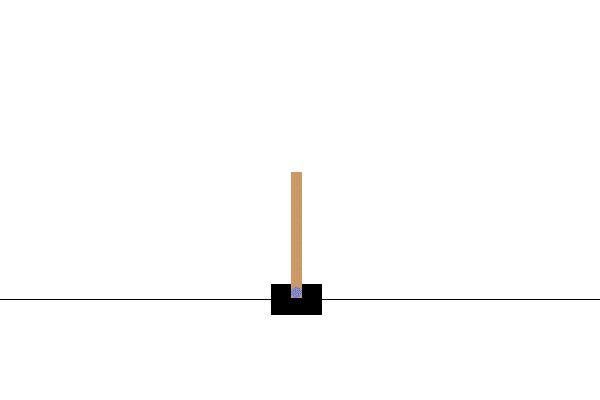

# OPTECOT - Optimal Evaluation Cost Tracking
 Judith Echevarrieta, Etor Arza and Aritz Pérez

## Repository content
This repository contains supplementary material for the paper _Speeding-up Evolutionary Algorithms to solve Black-Box Optimization Problems_. In this work, we have presented OPTECOT (Optimal Evaluation Cost Tracking): a technique to reduce the cost of solving a computationally expensive black-box optimization problem using population-based algorithms, avoiding loss of solution quality. OPTECOT requires a set of approximate objective functions of different costs and accuracies, obtained by modifying a strategic parameter in the definition of the original function. The proposal allows the selection of the lowest cost approximation with the trade-off between cost and accuracy in real time during the algorithm execution. The effectiveness of the proposal has been demonstrated in four different environments: **Symbolic Regressor**, **WindFLO**, **Swimmer** (from MuJoCo) and **Turbines**. In addition, future work has been motivated by using the environment **CartPole**. 

<table width='80%' align='center'>
  <tr>
    <td align='center'></td>
    <td align='center'></td>
    <td align='center'></td>
  </tr>
    <tr>
    <td align='center'><a href="https://github.com/trevorstephens/gplearn">Symbolic Regressor</a></td>
    <td align='center'><a href="https://github.com/sohailrreddy/WindFLO">WindFLO</a></td>
    <td align='center'><a href="https://github.com/Farama-Foundation/Gymnasium">Swimmer</a></td>
  </tr>
 </table>
 <table width='80%' align='center'>
  <tr>
    <td></td>
    <td></td>
  </tr>
    <tr>
    <td align='center'><a href="https://www.ssrn.com/abstract=4379648">Turbines</a> </td>
    <td align='center'><a href="https://github.com/araffin/rl-tutorial-jnrr19/blob/47cca257ce9814ee4be7a645e5411275284f1727/1_getting_started.ipynb">CartPole</a> </td>
  </tr>

 </table>

## Reproducing the experiments
### Install dependencies
The code in this repository has been executed using the Ubuntu 20.04 operating system. To run the Python scripts you must install the dependencies indicated in: `others/setup.sh`. Some dependencies may need to be modified or added to ensure functionality on other systems.

Install requirements for Linux:
```bash
sudo apt update
sudo apt install gcc
sudo aptitude install g++ 
sudo apt install gfortran
sudo apt install make
sudo apt install ffmpeg freeglut3-dev xvfb
sudo apt install venv
```

Install Python requirements:
```bash

# Generate Python virtual environment
python -m venv venv
source venv/bin/activate
pip install -U pip

# Symbolic Regressor
pip install gplearn
pip install graphviz
pip install plotly

# WindFLO
pip install f90nml
pip install git+https://github.com/CMA-ES/pycma.git@master
cd windflo/release/
make OS=LINUX MAIN=main
cd ../../

# Swimmer
pip install swig
pip install -r others/requirements.txt
pip install -r cleanrl/requirements/requirements-mujoco.txt
pip install -r cleanrl/requirements/requirements-mujoco_py.txt

cd ~/Downloads
wget -nc -c  wget -c 	https://mujoco.org/download/mujoco210-linux-x86_64.tar.gz  -O mujoco210.tar.gz
tar -x -k -f mujoco210.tar.gz
mkdir -p ~/.mujoco
rsync -vraR mujoco210 ~/.mujoco/

pip install 'mujoco-py<2.2,>=2.1'
pip install git+https://github.com/rlworkgroup/metaworld.git@master#egg=metaworld
pip install TensorFlow==2.11
pip install torch>=1.11
pip install garage
pip install pyglet
pip install tensorflow-cpu

# Turbines
pip install openpyxl
pip install termcolor

# CartPole
pip install stable-baselines3[extra]
pip install opencv-python==4.5.5.64
pip install scipy
pip install sklearn
pip install tqdm
pip install scikit-learn

```

### Experimental scripts, data and figures
The script associated with the experiments performed in each environment are located in the folders with the name: **experimentScripts**_*Environment name*. The experiments shown in the paper correspond to Python files with names starting with: *UnderstandingAccuracy*, *ConstantAccuracyAnalysis* and *OptimalAccuracyAnalysis*. The rest are additional experiments.

The results are distributed in two different folders: **results** and **figures_paper**. In the first one, both numerical and graphical results of the above mentioned experiments are gathered. In the second one instead, some of the previously named scripts ending in *_figures.py* are modified to design the graphics that are introduced in the paper.

To reproduce the complete experimental procedure carried out in the paper for each environment, the following steps must be followed (the Turbines environment is chosen as an example):

```bash
# Obtain data about evaluation times and ranking preservation for each approximate function.
python experimentScripts_Turbines/UnderstandingAccuracy_data.py

# Generate figure of evaluation times, extra evaluation proportions and ranking preservations 
# (Figure 3 in the paper).
python figures_paper/UnderstandingAccuracy_Turbines.py

# Obtain data about the use of approximate objective functions with constant cost.
python experimentScripts_Turbines/ConstantAccuracyAnalysis_data.py

# Generate figure of the solution quality curves associated with the use of approximate objective 
# functions with constant cost (Figure 4 in the paper).
python figures_paper/ConstantAccuracyAnalysis_Turbines.py

# Obtain data about OPTECOT application.
python experimentScripts_Turbines/OptimalAccuracyAnalysis_data.py

# Generate figures of OPTECOT application: solution quality curves (Figure 5 in the paper), 
# optimal cost behavior (Figure 7 in the paper), quality improvement curves and time saving 
# curves (Figure 6 in the paper).
python figures_paper/OptimalAccuracyAnalysis_Turbines.py
```


## Brief description of OPTECOT and its application
### How does OPTECOT work?
<figure>

<caption align='left'> 
Figure 1.- Summary of the problem definition and the proposed procedure for its resolution.
</caption>
</figure>

<figure>

  | Notation              | Meaning |
  | ----------------- | ----- |
  | $P_0, P_1, P$ | Populations (set of candidate solutions)|
  | $f$ | Objective function   |
  | $f_c$      | Approximation of cost $c$   |
  | $f_{c^*}$        | Optimal approximation   |
  | $t_c$           | Evaluation time of $f_c$    |
  | $r_c$             | Ranking of population after evaluating it with $f_c$    |
  | $A_c(P)$           | Accuracy of $f_c$ to order P   |
<caption align='left'> 
Table 1.- Glossary of Figure 1.
</caption>
</figure>


**The problem.** OPTECOT is designed to reduce the computational cost of _Rank-Based Evolutionary Algorithms (RBEA) when the cost per evaluation of the objective function is very high and the available computational resources are limited_. These algorithms update a set of solutions (population) iteratively, selecting those with the best associated objective values to generate the next set of candidate solutions (see the middle box of Figure 1). This approach allows for improving the solution as the execution progresses. However, to reach a near-optimal solution, a large number of solutions must be evaluated. In this context, if the cost per evaluation is high, the algorithm can provide a quality solution as long as we are willing to assume a high computational cost.

**The solution.** For the cost reduction of the original objective function, the use of _approximate objective functions of different costs_ is proposed. These approximations are obtained by modifying the accuracy of a parameter that participates in the definition of the objective function and allows us to control its cost. The lower cost approximations save time in the evaluation, although they are less accurate in terms of the ranking of the set of solutions they provide concerning the original one. This accuracy is important since a ranking of the population very different from the original one modifies the selection of the next population, which can lead to a decrease in the solution quality.

**Choosing the optimal cost in real time.** _OPTECOT selects during the algorithm execution process the optimal evaluation cost_, where the optimal cost is the one that looks for a balance between evaluation time saving and ranking accuracy. The approximate function selected as optimal is the minimum cost that can still rank the solutions accurately (see the last box of Figure 1).


### What problems does OPTECOT solve?
The procedure is designed to be applied to **population-based optimization algorithms**. In addition, it is necessary to have a **parameter** (denoted as $\theta$ in the paper) that is part of the definition of the objective function and whose modification allows us to control the computational cost of an evaluation. We tested OPTECOT in the four environments shown below (the selected parameter and algorithms can be consulted in Table 2), and it is also applicable to any other environment that meets these two requirements.

It is important to emphasize that OPTECOT has been designed to be applied when the available computational resources are not enough for the optimization algorithm to converge. Otherwise, it is not recommended to apply OPTECOT, since there is enough time for the original version of the algorithm to converge.
<figure>

| Environment| Solution ($x$) | Objective function ($f$) | Parameter | Algorithm|
| ----- | ----- |----- |-----|-----|
|  <a href="https://github.com/trevorstephens/gplearn">Symbolic Regressor</a> | Surface | Mean absolute error | Size of training point set | Genetic Programming |
| <a href="https://github.com/sohailrreddy/WindFLO">WindFLO</a> | Wind farm layout | Produced energy | monteCarloPts| CMA-ES|
| <a href="https://github.com/Farama-Foundation/Gymnasium">Swimmer</a> | Policy | Episode reward | Time-step| CMA-ES|
| <a href="https://www.ssrn.com/abstract=4379648">Turbines</a> | Design of floating wind turbine | Performance score in five sea states| N (number of subdivisions on the surface of each blade) | CMA-ES|
<caption align='left'> 
Table 2.- Brief description of each environment.
</caption>
</figure>

### Is OPTECOT effective?
<figure>
 
<caption align='left'> 
Figure 2.- Solution quality curves during the execution of the optimization algorithms (first row)  together with optimal cost behaviour (second row).
</caption>
</figure>

**Solution quality improvement and time-saving.** After applying the procedure to the selected environments, we observe that the solution quality exceeds the original one in most of the algorithm execution process (see the graphs in the first row of Figure 2, except in the last part of the turbines, the orange curves are above the blue ones). As a result, the runtimes required to achieve the original qualities have been reduced significantly. In the best case, it was possible to use on average only 45.65% of the time needed by the original objective function to reach its same solution quality.

**Optimal evaluation cost behaviour.** By tracking the optimal evaluation cost during the algorithm execution, OPTECOT allows to decrease or increase the cost of the objective function when needed (see the graphs in the second row of Figure 2). This leads to time savings in cases where the optimal cost is lower and maintains the quality of the solution when the optimal cost is higher.


 ## MonoObjective_OPTECOT library

To solve a different optimization problem (not necessarily related to the previous environments) by applying OPTECOT, we have created the MonoObjective_OPTECOT library (located in `library_OPTECOT/MonoObjective_OPTECOT.py`). Although theoretically the heuristic is designed to be applied to any RBEA, this library is implemented to apply OPTECOT with the CMA-ES (Covariance Matrix Adaptation Evolution Strategy) optimization algorithm.

To use MonoObjective_OPTECOT only requires the definition of certain parameters and the implementation of the objective function. With these inputs, the library allows us to solve the problem using the CMA-ES algorithm with the original objective function, an approximation with a predefined evaluation cost or by applying OPTECOT. Moreover, it is also possible to carry out the same experiments performed in the paper on the selected environments, but in this case on the newly available problem.  An example of use can be seen in the `library_OPTECOT/MonoObjective_Example.py` file, where the Turbines environment is used as an example. Overall, the steps to follow to use the library are described below: 

**Step 1** An instance of the OPTECOT class must be initialized by entering the values of the compulsory parameters:

*Required inputs*

- `popsize`: Population size to be considered in the RBEA (CMA-ES).
- `xdim`: The dimension of a solution to the optimization problem.
- `xbounds`: A matrix (list of lists) storing by rows the bounds (in case of continuous component) or explicit values (in case of discrete component) that can take each component that forms a random solutions of the problem to be optimized. For instance, if we have a problem with `xdim=3` where the first componen is continuos variable that takes values in [0,10], and the second and third components are discrete variables which can take the values {1,2,3} or {10,11,...,20}, respectively, `xbounds` will be defined as follows:
  ```python
  xbound=[[0,10], # List with lower and upper bound of the first continuous component
          [1,2,3], # List with all possible values that can take the second discrete component
          list(range(10,21)) # List with all possible values that can take the third discrete component
          ]
  ```
- `max_time`: Maximum time (in seconds) to execute optimization algorithm (CMA-ES).
- `theta0`,`theta1`: Value of the theta parameter associated with the minimum and maximum cost of the objective function, respectively.
- `objective_min`: True or False if the optimization problem is a minimization or maximization problem, respectively.
- `objective_function`: A function that implements the objective function of the optimization problem. It must have two arguments, `solution` and `theta`. The first one is a list that represents a candidate solution, and the second one is the parameter of the objective function that allows us to control its cost. In addition, it must return the evaluation `score` of the solution. The skeleton of the structure would be as follows:
  ```python
  def objective_function(solution,theta=theta1):
      ...
  return score
  ```
*Main code*

```python
# Import main class of the library.
from MonoObjective_OPTECOT import OPTECOT

# Initialize an instance of the class.
optecot=OPTECOT(popsize,xdim,xbounds,max_time,theta0,theta1, objective_min,objective_function)
```

Initializing the class for the first time takes some time, since in addition to setting the explicitly indicated parameters, other parameters are also calculated from the given ones. Moreover, a directory is created to store the data of interest obtained during this procedure. By default a folder called `results` will be created in the same path where this file MonoObjective_OPTECOT.py is located, being `library_OPTECOT/results/auxiliary_data` the path for auxiliary data , `library_OPTECOT/results/data` the path for main data and `library_OPTECOT/results/figures` the path for figures.

**Step 2** Once the class instance is initialized, it is possible to solve the available optimization problem using the CMA-ES algorithm in three different ways:

```python
# Solve problem with CMA-ES using original objective function
# (equivalently using the approximation with evaluation cost 1).
best_solution,score=optecot.execute_CMAES_with_approximations([1])

# Solve problem with CMA-ES using approximate objective function of a predefined
# evaluation cost (e.g. 0.5).
best_solution,score=optecot.execute_CMAES_with_approximations([0.5])

# Solve problem with CMA-ES applying OPTECOT.
best_solution,score=optecot.execute_CMAES_with_OPTECOT()
```
When executing each of the above lines of code, the results `best_solution` and `score` are obtained. The first one is a list of size `xdim` that represents the best solution found by the algorithm at time `max_time`. The second one instead is the objective value of `best_solution` obtained after evaluating it using the original objective function. In addition, for each solution of the problem (execution of one of the above lines) a database is saved (in `library_OPTECOT/results/data`) with the relevant data obtained during the execution of the CMA-ES algorithm.

**Step 3** Apart from solving the optimization problem, it is also possible to execute the experiments and analyses carried out in the paper on the selected problem. Three main experiments can be distinguished:

1. Initial experiment: A set of 100 random solutions is evaluated using approximations of the objective function of different costs. The results are shown graphically (Figure 3 in the paper), where the evaluation times and the ranking preservation of the approximations are represented. This graph allows us to assess the application of OPTECOT, as it shows if there is a lower-cost approximation that can save time and preserve the ranking of the best solutions.

2. Trade-off analysis between the cost and accuracy of different approximations: The optimization algorithm is run using different approximations. The quality of the solution obtained during the execution process with the use of each approximation is plotted in a graph (Figure 4 in the paper). This allows comparing the performance of the algorithm using different approximations and provides an intuition about the trade-off between cost and accuracy during the execution.

3. Benefits of applying OPTECOT: The solution quality obtained during the process of running the optimization algorithm using the original objective function is compared with that obtained by applying OPTECOT. In addition to constructing graphs comparing the online solution quality curves (Figure 5 in the paper), the behaviour of the optimal evaluation cost (Figure 7 in the paper) and the percentage of the original execution time used by OPTECOT to reach the original solution quality are also plotted (Figure 6 in the paper).

To draw the graphs, you must first build the databases with the necessary data. In this step, two main requirements must be fulfilled. On the one hand, the optimization algorithm must be run with the original objective function to compare the results with the original situation. On the other hand, the experiments must be performed with more than one seed for the comparisons to be reliable.

```python
# Execute the CMA-ES algorithm with different seeds (e.g 100) using approximate objective functions
# of different constant costs (e.g. the costs in {1.0,0.8,0.6,0.4,0.2,0} being 1 always among them)
# and save data of interest obtained during execution.
optecot.execute_CMAES_with_approximations([1.0,0.8,0.6,0.4,0.2,0],n_seeds=100)

# Execute the CMA-ES algorithm with different seeds (e.g. 100) applying OPTECOT and save data of
# interest obtained during execution.
optecot.execute_CMAES_with_OPTECOT(n_seeds=100)
```

With the necessary databases available, it is possible to construct the graphs:
```python
# Draw graph associated with experiment 1 (for its execution is not necessary to execute
# execute_CMAES_with_approximations method before).
ExperimentalGraphs.illustrate_approximate_objective_functions_use(optecot,title='Figure title')

# Draw graph associated with experiments 1 and 2 (for its execution is necessary to execute
# execute_CMAES_with_approximations method before).
ExperimentalGraphs.illustrate_approximate_objective_functions_use(optecot,title='Figure title',
initial_only=False,list_cots=[1.0,0.8,0.6,0.4,0.2,0])

# Draw graph associated with experiments 3 (for its execution is necessary to execute
# execute_CMAES_with_OPTECOT method before).
ExperimentalGraphs.illustrate_OPTECOT_application_results(optecot,title='Figure title')
```

**Step 4** *(possible suplementary of 3)* In the case of having available the necessary databases to draw the graphs because of having previously executed an instance of the class, it is not necessary to execute the methods `execute_CMAES_with_approximations` and `execute_CMAES_with_OPTECOT` again. It is enough to re-initialize another instance of the class with the same parameters and manually enter the paths to the directory where the data is stored.

```python
# Re-initialice another instance of the class.
optecot=OPTECOT(popsize,xdim,xbounds,max_time,theta0,theta1, objective_min, objective_function,
                customized_paths=['library_OPTECOT/results/auxiliary_data',
                                  'library_OPTECOT/results/data',
                                  'library_OPTECOT/results/figures'])

# Draw graph associated with experiments 1 and 2.
ExperimentalGraphs.illustrate_approximate_objective_functions_use(optecot,title='Figure title',
initial_only=False,list_costs=[1.0,0.8,0.6,0.4,0.2,0])

# Draw graph associated with experiments 3.
ExperimentalGraphs.illustrate_OPTECOT_application_results(optecot,title='Figure title')
```
This allows you to modify the graphs without having to run the CMA-ES again. For example, you could draw the graph associated to experiment 2 representing the curves of only some costs.
```python
# Draw graph associated with experiment 2 using only some cots 
# (being 1 always among the selected ones).
ExperimentalGraphs.illustrate_approximate_objective_functions_use(optecot,title='Figure title',
initial_only=False,list_cots=[1.0,0.6,0.2])
```
 ## References

[1] T. Stephens, H. van Kemenade, J. McDermott, T. Gates, A. Rai, B. Price, N. de Vos, S. Niculae, S. Ao, and I. Bell, “Gplearn - Genetic Programming in Python, with a scikit-learn inspired API.” Available: https://github.com/trevorstephens/gplearn

[2] S. Reddy, “WindFLO - A Framework for Fast Wind Farm Layout Optimization”, Mar. 2023. Available: https://github.com/sohailrreddy/WindFLO

[3] Farama-Foundation, “Gymnasium,” Farama Foundation, Apr. 2023. Available: https://github.com/Farama-Foundation/Gymnasium

[4] A. Zarketa-Astigarraga, A. Martin-Mayor, A. Maeso, B. De Miguel, M. Martinez-Agirre, and M. Penalba, “A computationally Efficient Ga-Based Optimisation Tool for the Design of Power Take-Off Systems in Realistic Wave Climates: The Wells Turbine Case,” SSRN, Preprint,
2023. Available: https://www.ssrn.com/abstract=4379648

[5] A. Raffin, T. Lips, A. KG, and P. Daniel, “Stable Baselines3 RL tutorial”, Apr. 2023. Available: https://github.com/araffin/rl-tutorial-jnrr19/blob/47cca257ce9814ee4be7a645e5411275284f1727/1_getting_started.ipynb


