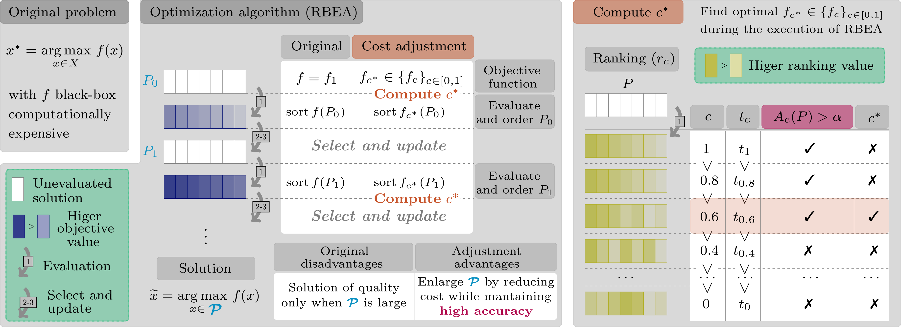

# OPTECOT - Optimal Evaluation Cost Tracking
 Judith Echevarrieta (jechevarrieta@bcamath.org),
 Etor Arza (earza@bcamath.org),
 Aritz Pérez (aperez@bcamath.org)

## Repository content
This repository contains supplementary material for the paper _Speeding-up Evolutionary Algorithms to solve Black-Box Optimization Problems_. In this work, we have presented OPTECOT (Optimal Evaluation Cost Tracking): a technique to reduce the cost of solving a computationally expensive black-box optimization problem using population-based algorithms, avoiding loss of solution quality. For this purpose, we use a set of approximate objective functions of different costs and accuracies, obtained by modifying a strategic parameter in the definition of the original function. The proposal allows the selection of the lowest cost approximation with the trade-off between cost and accuracy in real time during the algorithm execution. The effectiveness of the proposal has been demonstrated in four different environments: **Symbolic Regressor**, **WindFLO**, **Swimmer** (from MuJoCo) and **Turbines**. In addition, future work has been motivated by using the environment **CartPole**. 

<table width='80%' align='center'>
  <tr>
    <td align='center'></td>
    <td align='center'></td>
    <td align='center'></td>
  </tr>
    <tr>
    <td align='center'>Symbolic Regressor</td>
    <td align='center'>WindFLO</td>
    <td align='center'>Swimmer</td>
  </tr>
 </table>
 <table width='80%' align='center'>
  <tr>
    <td></td>
    <td></td>
  </tr>
    <tr>
    <td align='center'>Turbines</td>
    <td align='center'>CartPole</td>
  </tr>

 </table>

### Experiment Scripts
The script associated with the experiments performed in each environment are located in the folders with the name: **experimentScripts**_*Environment name*. The experiments shown in the paper correspond to Python files with names starting with: *UnderstandingAccuracy*, *ConstantAccuracyAnalysis* and *OptimalAccuracyAnalysis*. The rest are additional experiments.

### Results
The results are distributed in two different folders: **results** and **figures_paper**. In the first one, both numerical and graphical results of the above mentioned experiments are gathered. In the second one instead, some of the previously named scripts ending in *_figures.py* are modified to design the graphics that are introduced in the paper.

### Install dependencies
The code in this repository has been executed using the Ubuntu 20.04 operating system. To run the Python scripts you must install the dependencies indicated in: **others/setup.sh**. Some dependencies may need to be modified or added to ensure functionality on other systems.

```
bash others/setup.sh
```

## Brief description of OPTECOT and its application
### How OPTECOT works?
<figure>

<caption align='left'> 
Figure 1.- Summary of the problem definition and the proposed procedure for its resolution.
</caption>
</figure>

<figure>

  | Notation              | Meaning |
  | ----------------- | ----- |
  | $P_0, P_1, P$ | Populations (set of candidate solutions)|
  | $f$ | Objective function   |
  | $f_c$      | Approximation of cost $c$   |
  | $f_{c^*}$        | Optimal approximation   |
  | $t_c$           | Evaluation time of $f_c$    |
  | $r_c$             | Ranking of population after evaluating it with $f_c$    |
  | $A_c(P)$           | Accuracy of $f_c$ to order P   |
<caption align='left'> 
Table 1.- Glossary of Figure 1.
</caption>
</figure>


**The problem it faces.** OPTECOT is designed to reduce the computational cost of _Rank-Based Evolutionary Algorithms (RBEA) when the cost per evaluation of the objective function is very high and the available computational resources are limited_. These algorithms update a set of solutions (population) iteratively, selecting those with the best associated objective values to generate the next set of candidate solutions (see the middle box of Figure 1). This approach allows for improving the solution as the execution progresses. However, to reach a near-optimal solution, a large number of solutions must be evaluated. In this context, if the cost per evaluation is high, the algorithm can provide a quality solution as long as we are willing to assume a high computational cost.

**The tool used for resolution.** For the cost reduction of the original objective function, the use of _approximate objective functions of different costs_ is proposed. These approximations are obtained by modifying the accuracy of a parameter that participates in the definition of the objective function and allows us to control its cost. The lower cost approximations save time in the evaluation, although they are less accurate in terms of the ranking of the set of solutions they provide concerning the original one. This accuracy is important since a ranking of the population very different from the original one modifies the selection of the next population, which can lead to a decrease in the solution quality.

**Optimal use of the tool.** _OPTECOT selects during the algorithm execution process the optimal evaluation cost_, understanding as optimal the one that looks for a balance between evaluation time saving and ranking accuracy. The approximate function selected as optimal is the one with the minimum cost with which the solutions can still rank accurately (see the last box of Figure 1).


### What problems does OPTECOT solve?
The procedure is designed to be applied to **population-based optimization algorithms**. In addition, it is necessary to have a **parameter** that is part of the definition of the objective function and whose modification allows us to control the computational cost of an evaluation. Although OPTECOT has only been tested in four environments in this work (the selected parameter and algorithms can be consulted in Table 2), it applies to any other environment that meets these two requirements.

It is important to emphasize that OPTECOT has been designed to be applied in contexts where the available computational resources do not allow the optimization algorithm to converge. Otherwise, it is not recommended to apply OPTECOT, since there is enough time for the original version of the algorithm to converge.
<figure>

| Environment| Solution ($x$) | Objective function ($f$) | Parameter | Algorithm|
| ----- | ----- |----- |-----|-----|
| Symbolic Regressor | Surface | Mean absolute error | Size of training point set | Genetic Programming |
| WindFLO | Wind farm layout | Produced energy | monteCarloPts| CMA-ES|
| Swimmer | Policy | Episode reward | Time-step| CMA-ES|
| Turbines | Design of floating wind turbine | Performance score in five sea states| N (number of subdivisions on the surface of each blade) | CMA-ES|
<caption align='left'> 
Table 2.- Brief description of each environment.
</caption>
</figure>

### Is OPTECOT effective?
<figure>
 
<caption align='left'> 
Figure 2.- Solution quality curves during the execution of the optimization algorithms (first row)  together with optimal cost behaviour (second row).
</caption>
</figure>

**Solution quality improvement and time-saving.** After applying the procedure to the selected environments, it has been observed that the solution quality exceeds the original one in most of the algorithm execution process (see the graphs in the first row of Figure 2, except in the last part of the turbines, the orange curves are above the blue ones). As a result, the runtimes required to achieve the original qualities have been reduced significantly. In the best situation, it has been possible to use on average only 45.65% of the time needed by the original objective function to reach its same solution quality.

**Optimal evaluation cost behaviour.** By tracking the optimal evaluation cost during the algorithm execution, OPTECOT allows to decrease or increase the cost of the objective function when needed (see the graphs in the second row of Figure 2). This leads to time savings in cases where the optimal cost is lower and maintains the quality of the solution when the optimal cost is higher.

 ## References

[1] T. Stephens, H. van Kemenade, J. McDermott, T. Gates, A. Rai, B. Price, N. de Vos, S. Niculae, S. Ao, and I. Bell, “Gplearn - Genetic Programming in Python, with a scikit-learn inspired API.” Available: https://github.com/trevorstephens/gplearn

[2] S. Reddy, “WindFLO - A Framework for Fast Wind Farm Layout Optimization”, Mar. 2023. Available: https://github.com/sohailrreddy/WindFLO

[3] Farama-Foundation, “Gymnasium,” Farama Foundation, Apr. 2023. Available: https://github.com/Farama-Foundation/Gymnasium

[4] A. Zarketa-Astigarraga, A. Martin-Mayor, A. Maeso, B. De Miguel, M. Martinez-Agirre, and M. Penalba, “A computationally Efficient Ga-Based Optimisation Tool for the Design of Power Take-Off Systems in Realistic Wave Climates: The Wells Turbine Case,” SSRN, Preprint,
2023. Available: https://www.ssrn.com/abstract=4379648

[5] A. Raffin, T. Lips, A. KG, and P. Daniel, “Stable Baselines3 RL tutorial”, Apr. 2023. Available: https://github.com/araffin/rl-tutorial-jnrr19/blob/47cca257ce9814ee4be7a645e5411275284f1727/1_getting_started.ipynb


